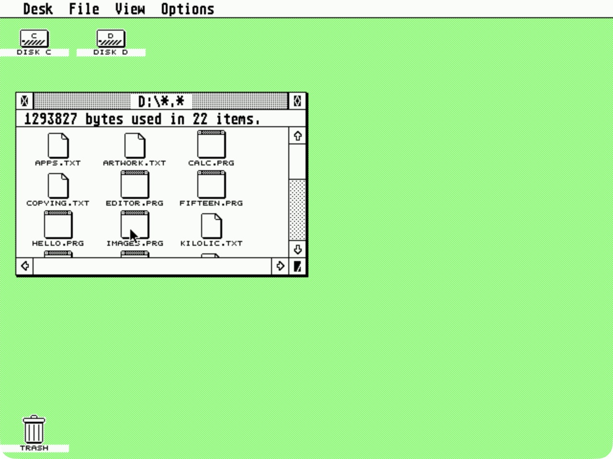
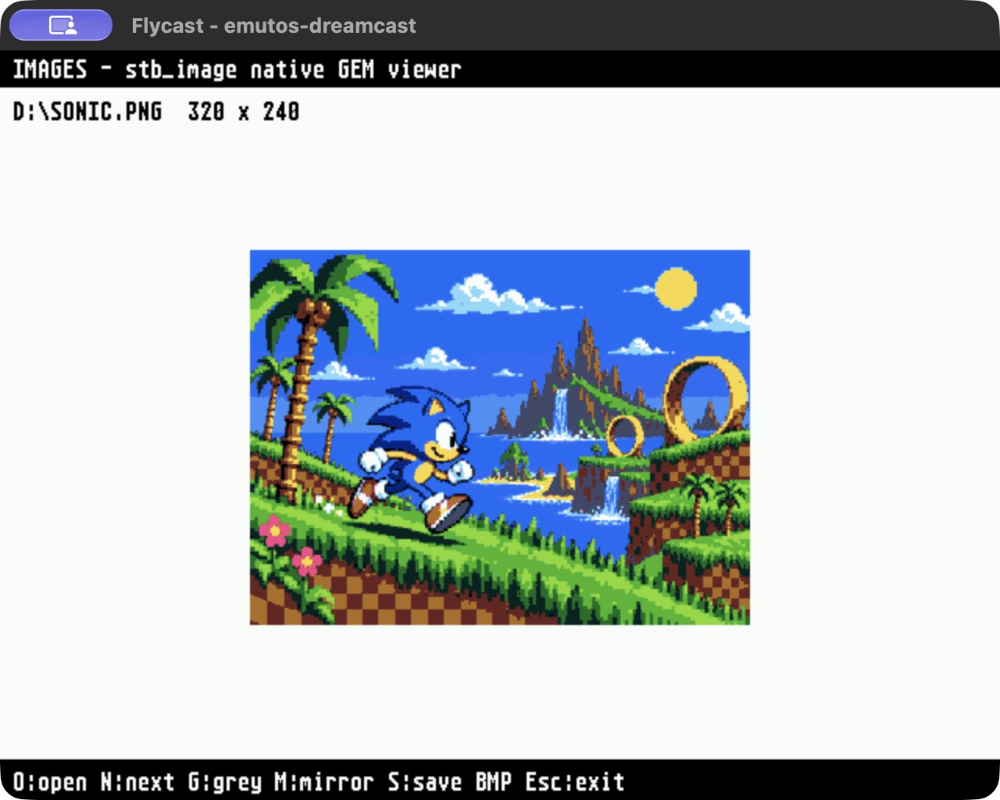
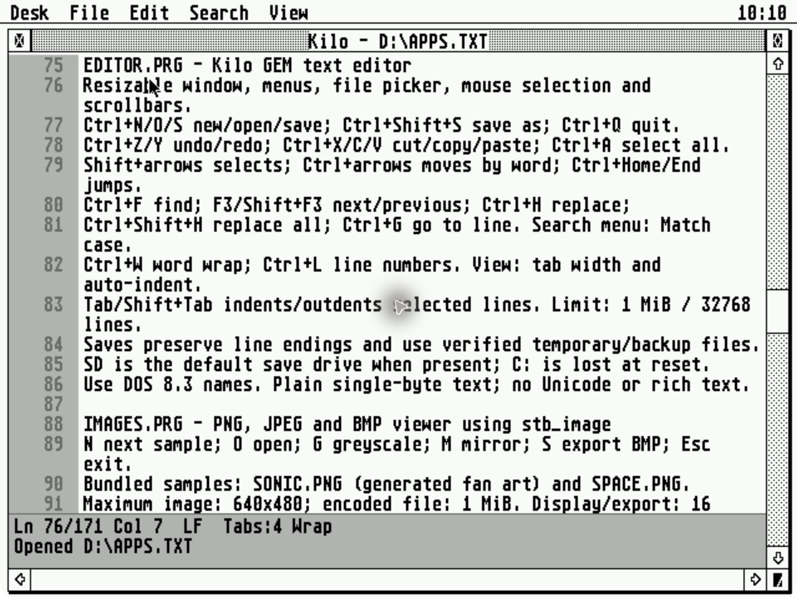
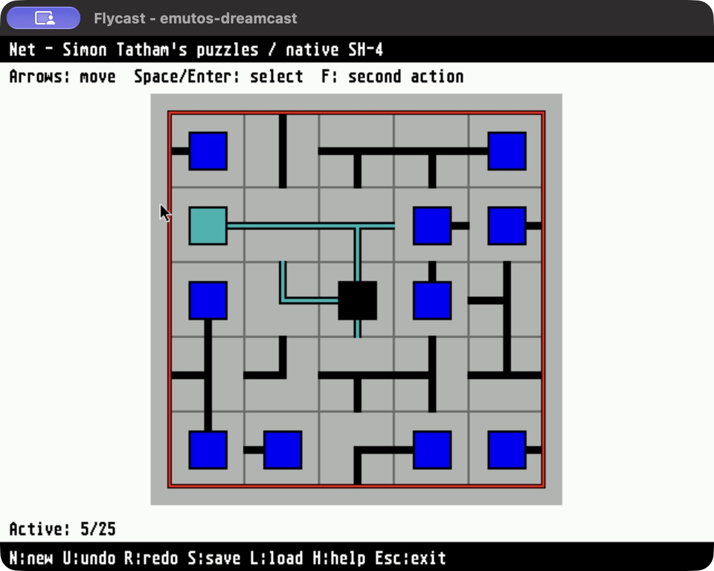
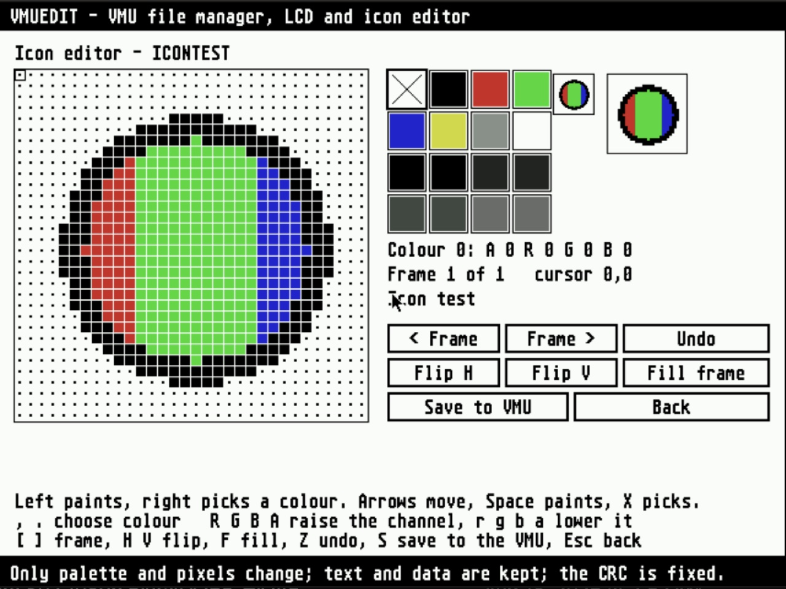
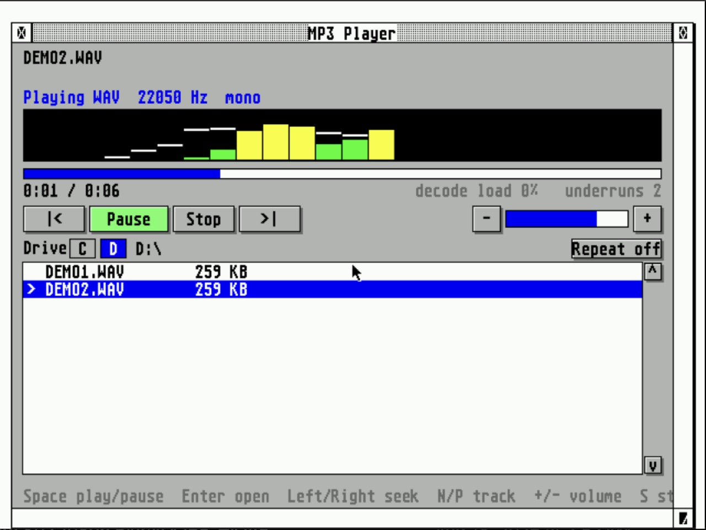
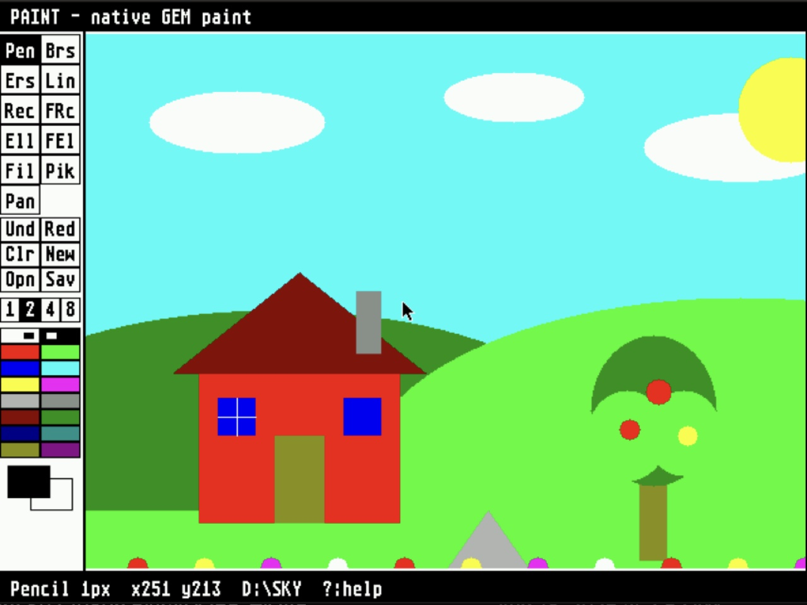
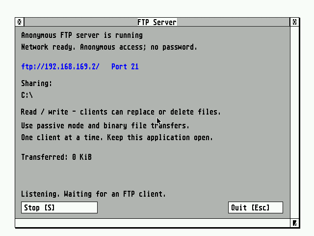
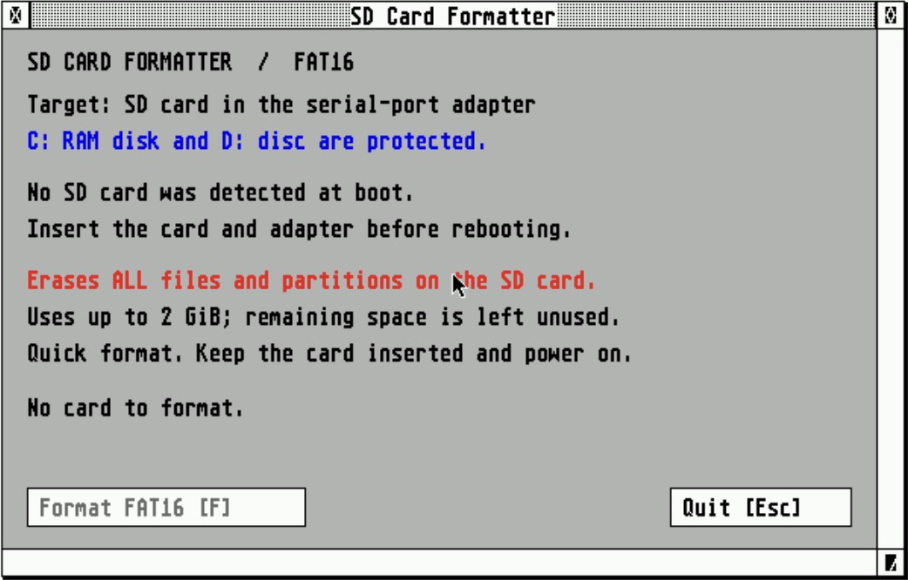
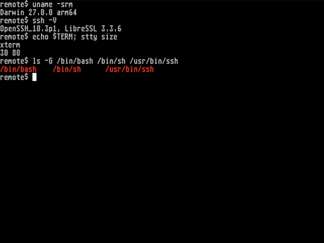

# Dream TOS

[Download the latest CDI](https://github.com/richstokes/Dream-TOS/releases/download/continuous/DreamTOS.cdi)
or browse [GitHub releases](https://github.com/richstokes/Dream-TOS/releases/tag/continuous).

Dream TOS is a native SH-4 port of [EmuTOS](https://emutos.sourceforge.io/), using KallistiOS
for Dreamcast hardware. The actual EmuDesk, AES, VDI and GEMDOS filesystem C
code is compiled for the Dreamcast. **This is not an emulator!** Existing
Atari executables cannot run; applications must be rebuilt for this port's
[native ABI](docs/NATIVE-ABI.md).

## Why?

Back in the day, I was fascinated with the idea of making the Dreamcast more of a “home computer”. Friends had Ataris, Amigas, etc, but I only had consoles :-) The Dreamcast was well-suited, having keyboard, mouse and ethernet support. I remember trying an early FreeBSD CD on the console and running some basic commands circa 2001.

This project aims to port a period-correct desktop/graphical OS. I chose this port of Atari's TOS because it's open source. Amiga workbench or even RiscOS would be interesting to try also, but I wanted something that I could freely distribute.

Bundled are a selection of games, apps and utilities. Suggestions welcome. 


<table>
  <tr>
    <td width="50%" align="center">
      <a href="docs/screenshots/desktop.jpg"></a><br>
      <strong>EmuDesk desktop</strong>
    </td>
    <td width="50%" align="center">
      <a href="docs/screenshots/image-viewer.jpg"></a><br>
      <strong>Native image viewer</strong>
    </td>
  </tr>
  <tr>
    <td width="50%" align="center">
      <a href="docs/screenshots/text-editor-window.png"></a><br>
      <strong>Kilo text editor</strong>
    </td>
    <td width="50%" align="center">
      <a href="docs/screenshots/net-puzzle.jpg"></a><br>
      <strong>Net puzzle</strong>
    </td>
  </tr>
  <tr>
    <td width="50%" align="center">
      <a href="docs/screenshots/control-panel.jpg"></a><br>
      <strong>Dreamcast Control Panel</strong>
    </td>
    <td width="50%" align="center">
      <a href="docs/screenshots/vmu-editor.jpg"></a><br>
      <strong>VMU editor (save icon)</strong>
    </td>
  </tr>
  <tr>
    <td width="50%" align="center">
      <a href="docs/screenshots/mp3-player.jpg"></a><br>
      <strong>MP3 / WAV player</strong>
    </td>
    <td width="50%" align="center">
      <a href="docs/screenshots/paint.jpg"></a><br>
      <strong>Paint</strong>
    </td>
  </tr>
  <tr>
    <td width="50%" align="center">
      <a href="docs/screenshots/ftp-server.png"></a><br>
      <strong>FTP server</strong>
    </td>
    <td width="50%" align="center">
      <a href="docs/screenshots/sd-card-formatter.png"></a><br>
      <strong>SD card formatter</strong>
    </td>
  </tr>
  <tr>
    <td width="50%" align="center">
      <a href="docs/screenshots/ssh-client.png"></a><br>
      <strong>SSH remote terminal</strong>
    </td>
    <td width="50%" align="center">
      <a href="docs/screenshots/vmu-toolbox-hex.png"></a><br>
      <strong>VMU Toolbox (hex / ASCII editor)</strong>
    </td>
  </tr>
</table>

The bootable CDI runs on real Dreamcast hardware and in Flycast.

- Display: 640×480, 16-colour planar VDI converted to Dreamcast RGB565.
- Input: Maple keyboard and mouse; controller fallback when no mouse is attached.
- C: 4 MiB FAT16 RAM disk. Contents disappear at reset.
- D: read-only FAT16 volume embedded in the CD's ISO9660 filesystem.
- Network: Broadband Adapter (DHCP, ping, DNS), command-line tools, and a [graphical anonymous FTP server](docs/FTP.md) with SD/folder sharing, plus an [SSH remote terminal](docs/SSH.md) with password, interactive and SD-card key login; see [networking](docs/NETWORKING.md).
- E:–H: writable FAT16 volumes from an SD card on the serial port (jj1odm/DreamShell-style adapter). Use `D:\UTILS\SDFORMAT.PRG` for the graphical FAT16 formatter, with C:/D: protection and automatic remount or a reboot prompt; see [SD card support](docs/SD.md). SD transfers remain untested on hardware.
- 68000 binary compatibility is absent.

The CDI includes a [native application bundle](docs/BUNDLE.md): Kilo text editor,
an image viewer with two sample pictures and BMP export, a 16-colour paint program with undo and BMP save/open, a scientific
calculator in a movable, resizable GEM window, a [native benchmark](docs/BENCHMARK.md),
GEM Worm, Blocks (a falling-block game), Paint, a VMU editor, Simon Tatham's Fifteen, Mines and Net, and an [MP3/WAV player](docs/AUDIO.md) that plays files from the SD card. Sources and licenses are
stored in `apps/`; all programs
are rebuilt for SH-4. Open
`APPS.TXT` on D: for controls. Documents, images and game saves go to C: and
are lost at reset.

Open D: in EmuDesk, then choose a folder:

| Folder | Contents |
| --- | --- |
| `APPS` | Editor, image viewer, paint and MP3/WAV player |
| `GAMES` | Blocks, Fifteen, Mines, Net and Worm |
| `UTILS` | FTP server, VMU editor, FAT16 SD card formatter, system information, benchmark, diagnostics and command-line tools |

Startup `.ACC` accessories, guides, sample pictures and license notices remain
at the disc root. `UTILS` keeps the folder name within the DOS 8.3 limit.

The **EmuCON command prompt** is available through **File → Execute EmuCON**
or **Ctrl+Z**; type `exit` to return to the desktop. It includes file commands,
history, Tab completion and output redirection, plus twelve native text and
system utilities and four network tools (`ping`, `nslookup`, `ifconfig`, `ssh`) on D:. See the [command-line guide](docs/COMMAND-LINE.md)
or read `D:\CLI.TXT` for commands and examples.

The menu bar shows a **24-hour clock** at the upper right, using the console's
system time initialized from the Dreamcast RTC (or Flycast's emulated RTC).
It updates automatically and leaves room for application menu titles.

The **Clock desk accessory** also loads at boot. Choose **Desk → Clock** for an
analogue and digital clock over the live desktop. Close or press Esc to hide
it, then reopen it from the same menu. See the [clock screenshot and controls](docs/BUNDLE.md#clock-desk-accessory).

Choose **Desk → Calculator** for the resident scientific calculator. Its window
shares the desktop with other windows; closing it or pressing Esc hides it and
retains the expression and answer. See the [accessory guide](docs/ACCESSORIES.md#calculator).

Two more native desk accessories are available from **Desk**:
**DC Control** adjusts mouse speed, keyboard repeat and desktop colour, with
VMU save/load and automatic restoration at boot;
**System Monitor** shows memory, disk space and connected devices.

**VMU Toolbox** (`D:\UTILS\VMUEDIT.PRG`) combines card directories and metadata,
file import/export/rename/delete, a graphical hex/ASCII save viewer/editor,
and LCD and icon editors. **From SD / To SD** transfers saves to mounted SD
volumes, with overwrite confirmations and verified exports. Browsing uses read commands only; saving raw edits
requires confirmation before overwriting the original.
See [screenshots, controls and VMU testing](docs/ACCESSORIES.md).

## Build and run

Install a KallistiOS SDK with an SH-4 GCC toolchain. Set `KOS_ENV` to its
`environ.sh`; the default is `~/.local/share/dreamcast/kos/environ.sh`.
The tested SDK is KOS 2.3.0, commit
`cd340378043f00cd1d05284ee0d02548d33d6054`, with SH GCC 15.2.0.
Host tools: Git, C/C++ compiler, make, Python 3, Ninja, pkg-config and libisofs.
On macOS the latter dependencies can be installed with
`brew install ninja pkg-config libisofs`.

```sh
./scripts/bootstrap-mkdcdisc.sh  # one-time pinned disc-image tool build
./scripts/build-cdi.sh
./scripts/run-flycast.sh
```

Output: `dist/DreamTOS.cdi`, `dist/dream-tos.elf` and SHA256SUMS.
`MKDCDISC` can select an existing mkdcdisc executable. `FLYCAST_BIN` can select
Flycast. With no arguments, the launcher boots `dist/DreamTOS.cdi`
and builds it if missing. Rebuild with `./scripts/build-cdi.sh` after source
changes. Pass an image path to boot another image. `./scripts/build.sh`
builds only the ELF; booting it directly in Flycast has no disc, D: drive or
bundled applications/accessories. Network uploads can serve D: from the host
through dcload, as described below.
Add files or folders with DOS 8.3 names to `disc/` and rebuild to include them on D:.

See [network-upload hardware testing](docs/TESTING.md#network-upload-hardware-testing)
for setup, overrides and logs.

For keyboard-only Flycast testing, detach the host mouse route:

```sh
FLYCAST_HOST_MOUSE_PORT=-1 ./scripts/run-flycast.sh "$PWD/dist/DreamTOS.cdi"
```

Alt+C / Alt+D opens a drive. Alt+arrow moves the GEM pointer (Shift adds fine
movement); Alt+Space or Alt+Insert clicks. Select a file, then Ctrl+O opens it.
Return accepts a dialog; Escape leaves the text viewer. Ctrl+N creates a folder.
Flycast's Left Ctrl+Left Alt shortcut toggles mouse capture when those keys are
not mapped to controller actions. The host pointer and the guest pointer can
occupy different positions; use the guest pointer. Automated capture testing
on macOS has not been reliable.

See [hardware testing and limitations](docs/TESTING.md),
[architecture](docs/ARCHITECTURE.md) and [upstream provenance](docs/UPSTREAM.md).
EmuTOS and this port are GPL-2.0-or-later; see COPYING.
