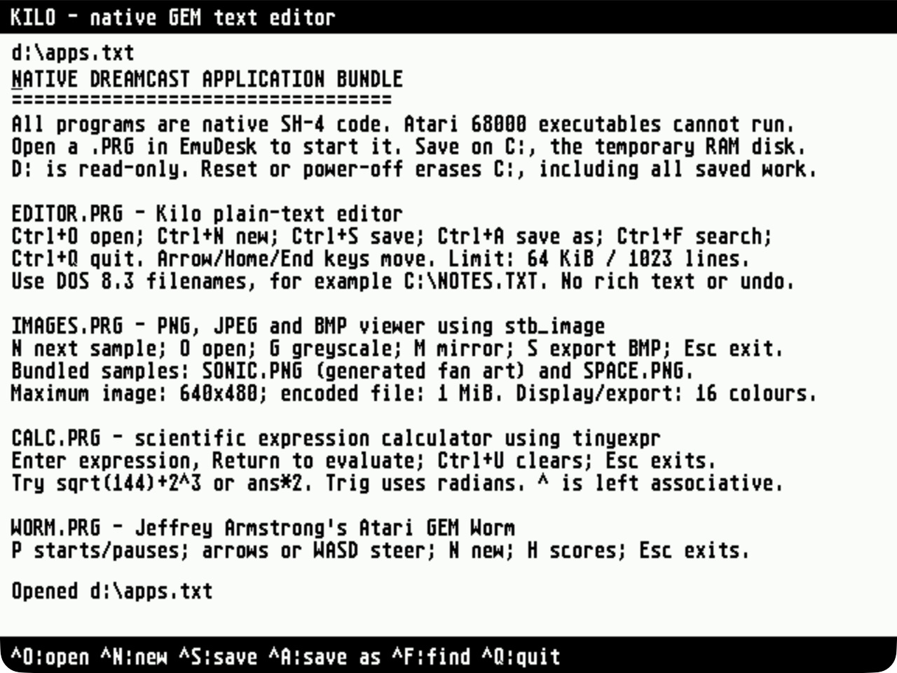
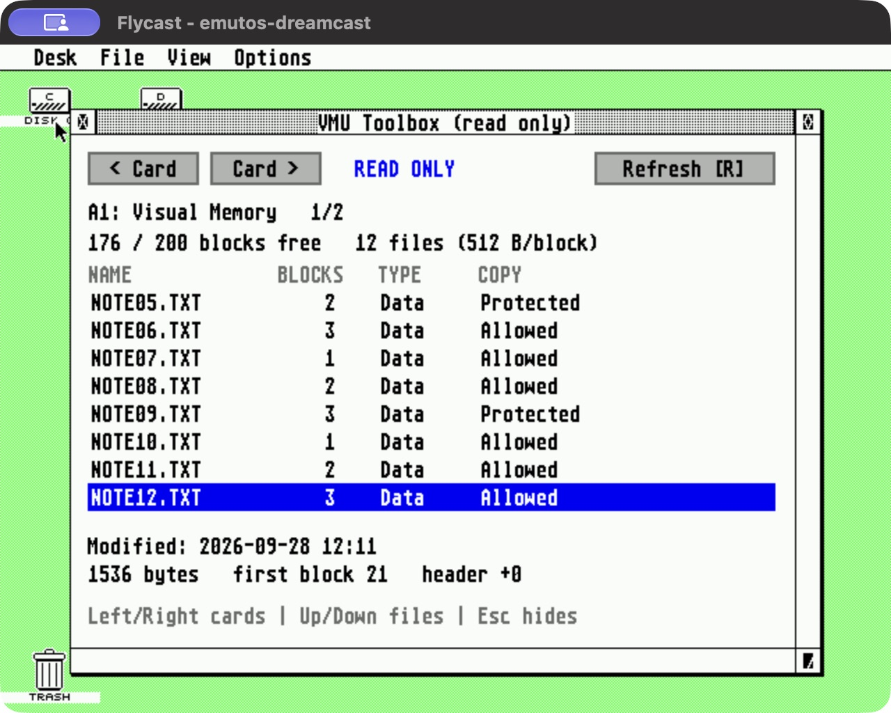

# Native EmuTOS for Sega Dreamcast

[Download the latest CDI](https://github.com/richstokes/dreamcast-EmuTOS-port/releases/download/continuous/emutos-dreamcast.cdi)
or browse [GitHub releases](https://github.com/richstokes/dreamcast-EmuTOS-port/releases/tag/continuous).
Successful CI builds from `main` update these downloads; see [CI details](docs/CI.md).

A native SH-4 port of [EmuTOS](https://emutos.sourceforge.io/), using KallistiOS
for Dreamcast hardware. The actual EmuDesk, AES, VDI and GEMDOS filesystem C
code is compiled for the Dreamcast. **There is no 68000 emulator.** Existing
Atari executables cannot run; applications must be rebuilt for this port's
[native ABI](docs/NATIVE-ABI.md).

<table>
  <tr>
    <td width="50%" align="center">
      <a href="docs/screenshots/desktop.jpg"></a><br>
      <strong>EmuDesk desktop</strong>
    </td>
    <td width="50%" align="center">
      <a href="docs/screenshots/image-viewer.jpg"></a><br>
      <strong>Native image viewer</strong>
    </td>
  </tr>
  <tr>
    <td width="50%" align="center">
      <a href="docs/screenshots/text-editor.jpg"></a><br>
      <strong>Kilo text editor</strong>
    </td>
    <td width="50%" align="center">
      <a href="docs/screenshots/net-puzzle.jpg"></a><br>
      <strong>Net puzzle</strong>
    </td>
  </tr>
  <tr>
    <td width="50%" align="center">
      <a href="docs/screenshots/control-panel.jpg"></a><br>
      <strong>Dreamcast Control Panel</strong>
    </td>
    <td width="50%" align="center">
      <a href="docs/screenshots/vmu-toolbox.jpg"></a><br>
      <strong>VMU Toolbox (read only)</strong>
    </td>
  </tr>
</table>

Captured from the native SH-4 build running in Flycast. Click an image for full size.

The bootable CDI runs in Flycast. Verified operations include launching a
separately compiled SH-4 GEM application and returning to the desktop, reading
files from the disc, creating folders using the keyboard, and RAM-disk file
operations.

- Display: 640×480, 16-colour planar VDI converted to Dreamcast RGB565.
- Input: Maple keyboard and mouse; controller fallback when no mouse is attached.
- C: 4 MiB FAT16 RAM disk. Contents disappear at reset.
- D: read-only FAT16 volume embedded in the CD's ISO9660 filesystem.
- Serial SD, persistent writable storage and 68000 binary compatibility are absent.

The CDI includes a [native application bundle](docs/BUNDLE.md): Kilo text editor,
an image viewer with two sample pictures and BMP export, a scientific
calculator in a movable, resizable GEM window, a [native benchmark](docs/BENCHMARK.md),
GEM Worm, and Simon Tatham's Fifteen, Mines and Net. Sources and licenses are
stored in `apps/`; all programs
are rebuilt for SH-4. Open
`APPS.TXT` on D: for controls. Documents, images and game saves go to C: and
are lost at reset.

The **Clock desk accessory** loads at boot. Choose **Desk → Clock** for an
analogue and digital clock over the live desktop. Close or press Esc to hide
it, then reopen it from the same menu. See the [clock screenshot and controls](docs/BUNDLE.md#clock-desk-accessory).

Three more native desk accessories are available from **Desk**:
**DC Control** adjusts mouse speed, keyboard repeat and desktop colour;
**System Monitor** shows memory, disk space and connected devices;
**VMU Toolbox** browses card directories and metadata using read commands only.
See [screenshots, controls and VMU testing](docs/ACCESSORIES.md).

## Build and run

Install a KallistiOS SDK with an SH-4 GCC toolchain. Set `KOS_ENV` to its
`environ.sh`; the default is `~/.local/share/dreamcast/kos/environ.sh`.
The tested SDK is KOS 2.3.0, commit
`cd340378043f00cd1d05284ee0d02548d33d6054`, with SH GCC 15.2.0.
Host tools: Git, C/C++ compiler, make, Python 3, Ninja, pkg-config and libisofs.
On macOS the latter dependencies can be installed with
`brew install ninja pkg-config libisofs`.

```sh
./scripts/bootstrap-mkdcdisc.sh  # one-time pinned disc-image tool build
./scripts/build-cdi.sh
./scripts/run-flycast.sh
```

Output: `dist/emutos-dreamcast.cdi`, `dist/emutos-dreamcast.elf` and SHA256SUMS.
`MKDCDISC` can select an existing mkdcdisc executable. `FLYCAST_BIN` can select
Flycast. With no arguments, the launcher boots `dist/emutos-dreamcast.cdi`
and builds it if missing. Rebuild with `./scripts/build-cdi.sh` after source
changes. Pass an image path to boot another image. `./scripts/build.sh`
builds only the ELF; explicitly booting that ELF has no disc, D: drive or
bundled applications/accessories.
Add files with DOS 8.3 names to `disc/` and rebuild to include them on D:.

For keyboard-only Flycast testing, detach the host mouse route:

```sh
FLYCAST_HOST_MOUSE_PORT=-1 ./scripts/run-flycast.sh "$PWD/dist/emutos-dreamcast.cdi"
```

Alt+C / Alt+D opens a drive. Alt+arrow moves the GEM pointer (Shift adds fine
movement); Alt+Space or Alt+Insert clicks. Select a file, then Ctrl+O opens it.
Return accepts a dialog; Escape leaves the text viewer. Ctrl+N creates a folder.
Flycast's Left Ctrl+Left Alt shortcut toggles mouse capture when those keys are
not mapped to controller actions. The host pointer and the guest pointer can
occupy different positions; use the guest pointer. Automated capture testing
on macOS has not been reliable.

See [hardware testing and limitations](docs/TESTING.md),
[architecture](docs/ARCHITECTURE.md) and [upstream provenance](docs/UPSTREAM.md).
EmuTOS and this port are GPL-2.0-or-later; see COPYING.
