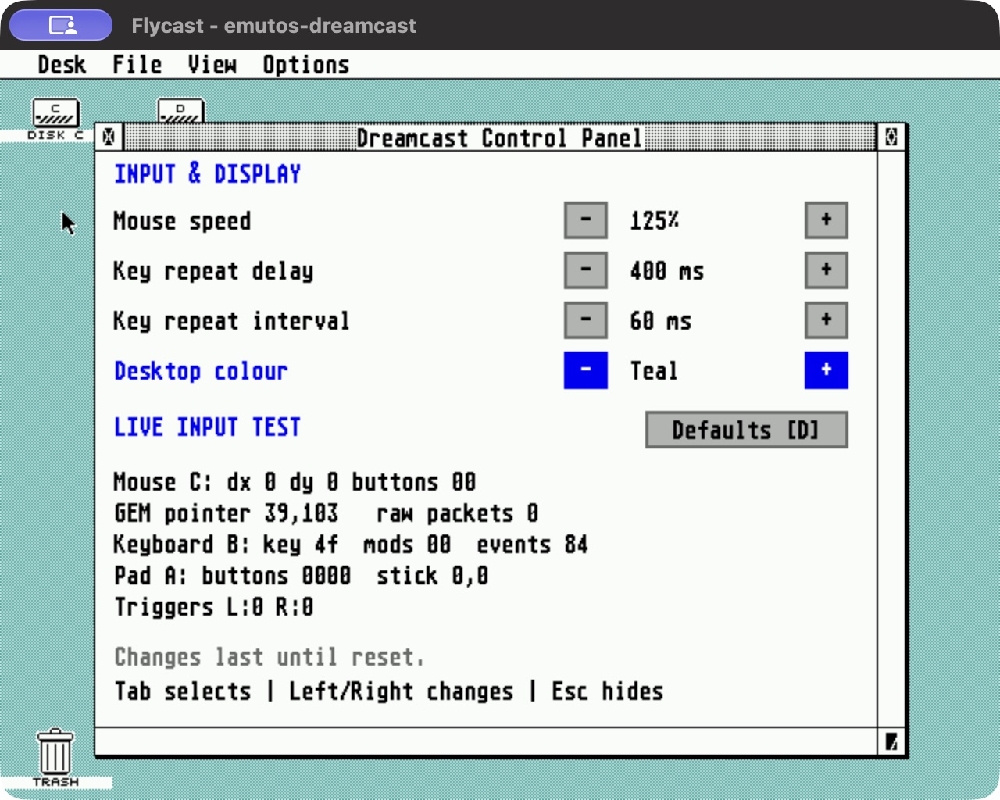
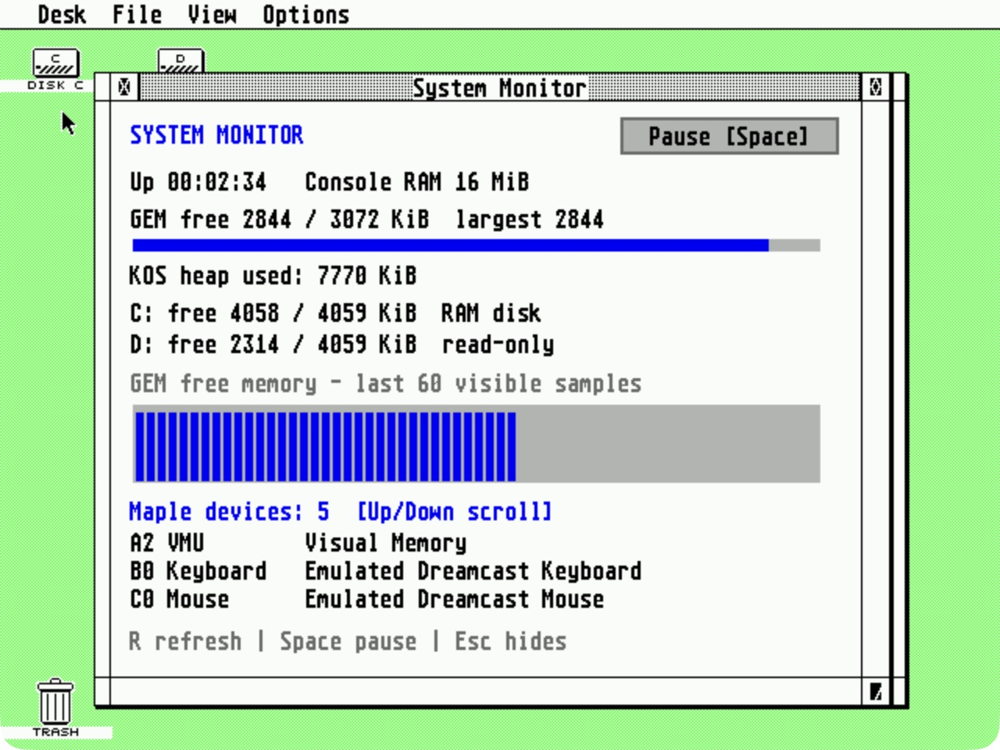
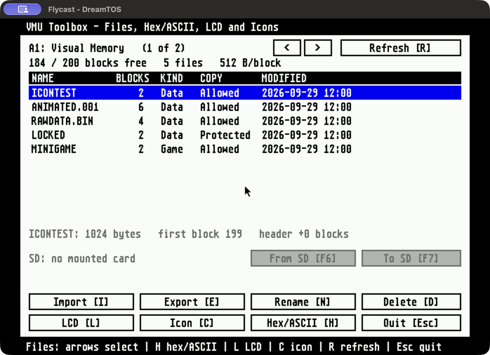
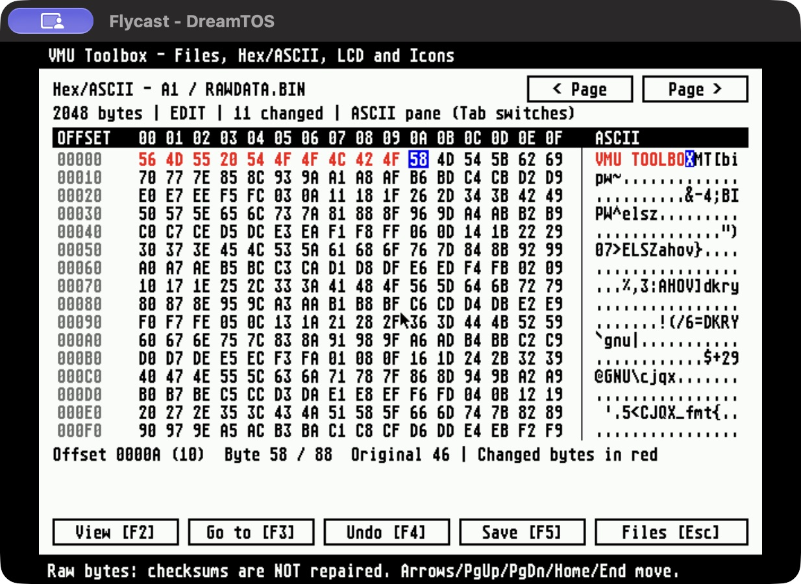
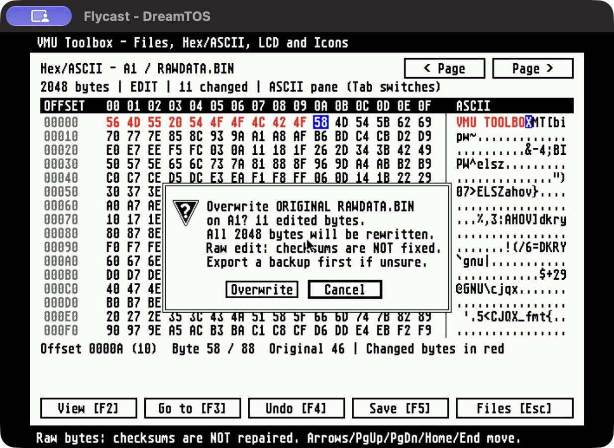

# Dreamcast desk accessories and VMU Toolbox

The CDI loads `CALC.ACC`, `CONTROL.ACC`, `MONITOR.ACC` and `CLOCK.ACC` at boot.
Open them from **Desk → Calculator**, **DC Control**, **System Monitor** or **Clock**. They are native SH-4 GEM programs, and the desktop remains
usable behind their windows. Do not launch `.ACC` files by double-clicking.

Close a window or press **Esc** to hide it; choose its Desk entry to reopen
or raise it. Drag the GEM title and size gadgets, or use **Ctrl+arrows** to
move and **Ctrl+Shift+arrows** to resize. Starting or exiting a foreground
program hides accessory windows; the accessories remain resident. Hidden
accessories wait for messages without running their periodic updates.

## Calculator

**Desk → Calculator** opens or raises a movable, resizable scientific calculator.
The close box or Esc hides it without clearing its expression, last answer,
or error. Reopen it from Desk to continue; AC or Ctrl+U clears the calculation.
Use the graphical keypad or type expressions, including `ans` for the last
answer. Tab/arrows/Space operate the keypad. Ctrl+arrows move the window,
Ctrl+Shift+arrows resize it, and F5 toggles full size.

This is cooperative AES accessory execution: the desktop and other accessory
windows remain usable. Foreground program switches can discard accessory
windows; reopen Calculator from Desk when available and its calculation will
still be there. Fullscreen programs that own the screen/input can prevent
access to accessories while they run. This does not add preemptive multitasking
between foreground programs. A hidden calculator waits only for AES messages.

## Dreamcast Control Panel



| Setting | Range | Default |
|---|---|---|
| Physical Maple mouse speed | 25–400% | 100% |
| Keyboard repeat delay | 100–1000 ms | 300 ms |
| Keyboard repeat interval | 20–200 ms | 40 ms |
| Desktop colour | Original, Teal, Slate, Amber | Original |

**Tab** selects a setting, VMU or action. **Left/Right** adjusts a setting;
**D** restores defaults. The on-screen minus, plus and Defaults buttons
also accept mouse clicks. Changes apply immediately; **S / Save** stores them
on the selected VMU and **L / Load** restores that card's saved settings.
Select **Settings VMU** with Tab and use Left/Right, or click its arrow buttons,
to choose a connected card. Saving writes only `EMUTOS.CFG`, a two-block
(1024-byte) EmuTOS save with a 32×32 colour settings icon. Keep the card inserted
until the result appears. Original one-block saves still load and gain the icon
on the next Save, requiring one extra free block.
Defaults changes the session; press Save to make those defaults persistent.

At boot, `CONTROL.ACC` reads connected cards in port/unit order and applies
the first valid save, including the desktop colour. Missing or invalid saves
leave the initial settings unchanged. Reopening the panel does not reload or
discard unsaved changes. Cards inserted later can be selected and loaded manually.
There are no automatic writes; once the icon is present, repeated saves of
identical data do not rewrite the card. Failed loads leave the current settings
unchanged. Full, missing,
unformatted or damaged cards display an error. Foreign, protected or malformed
VMS files named `EMUTOS.CFG` are not overwritten. Save verifies the data before
reporting success. Browsing in VMU Toolbox uses read commands only.

Mouse speed does not change the Alt+arrow keyboard pointer or controller
fallback speed; fractional movement is retained at slow mouse settings.

The live input section displays the most recent raw mouse motion, mouse
buttons, GEM pointer position, keyboard key/modifier codes and event counts,
and controller buttons, stick and triggers. It samples cached input every
200 ms without consuming extra input events. This helps distinguish the
Dreamcast pointer from Flycast's separate host cursor.

Desktop colour changes palette entry 3, so other objects using that colour
also change. Bundled fullscreen programs save and restore the palette.
Resolution and controller remapping are not configurable here.

## System Monitor



Shows console uptime and RAM, GEM free/total memory and its largest free
block (in KiB), KOS heap usage, C:/D: free space, and attached Maple devices.
The graph records the last 60 visible samples of **GEM free memory**, with a
one-second sampling interval. There is no estimated CPU-load percentage.
GEM allocations live within the OS's memory arrangement; GEM and KOS figures
are different allocator views and should not be added as independent pools.

**Space** pauses/resumes sampling, **R** takes a fresh sample, and **Up/Down**
scrolls the device list. Reopening the window refreshes the snapshot.
C: is still temporary RAM storage and D: is still read-only.

<a id="vmu-toolbox-read-only"></a>
<a id="vmu-editor-vmuedit-prg"></a>

## VMU Toolbox (VMUEDIT.PRG)



`D:\UTILS\VMUEDIT.PRG` is the unified fullscreen graphical VMU program. Start
it from EmuDesk. The former `VMUTOOL.ACC` directory browser is merged into
this app and is no longer bundled or registered in the Desk menu. The program
keeps the `VMUEDIT.PRG` filename for existing launch paths.

The Files screen is the hub for card browsing, a hex/ASCII save viewer/editor,
a 48x32 LCD editor and a VMS save-icon editor. It lists connected cards,
free/total blocks, filenames, block counts, Data/Game type, copy flags and
modification times. The selected file also shows its allocated bytes, first
block and exact header block offset. Blocks are 512 bytes, including headers
and padding. Mouse and controller pointer/A/B operate the graphical controls;
keyboard shortcuts are shown on each screen.

Browsing reads metadata only, on opening, card selection and explicit refresh.
The timer enumerates devices without reading cards and invalidates stale
listings on observed device changes. No card formatting is offered. Supported
layouts are standard 128 KiB VMUs with one FAT block and up to 16 directory
blocks; damaged, unreadable or unsupported layouts show a reason. Writes use
the validated [VMU file service](NATIVE-ABI.md).

**Files** (card selector, directory, free blocks): `Left/Right` card, `Up/Down`
file, `Page Up/Page Down` move 10 files, `Home/End` first/last, `R` refresh
(cards are never read in the background), then

- `I` **import** a file from C:, D: or an SD drive (E:-H:) with a built-in file
  chooser (Enter opens, Backspace goes up, Tab changes drive). The default name
  is the file name without a `.VMS` extension, editable to 1-12 characters. It
  is stored as an ordinary data file, zero-padded to 512-byte blocks; the limit
  is 200 blocks (100 KiB). An existing name needs a separate "Replace" answer.
- `E` **export** the selected file as its raw block image (`blocks x 512` bytes) to
  a writable drive. The default name keeps a short extension from the VMU name or
  uses `.VMS` (so `SONICADV_SYS` becomes `SONICADV.VMS`); read-only drives (D:)
  are refused and an existing file needs confirmation. A `.VMS` written this way
  is the file exactly as the VMU holds it; the tool does not use the byte-swapped
  Nexus **`.DCI`** container and does not read or write it, because it could not
  be checked against real DCI files here. Copy-protected files are not exported.
- `N` **rename**: copies the file to the new name, verifies it, then deletes the
  old one (it therefore needs free blocks equal to the file's size, refuses an
  existing target name, and gives the file a new timestamp and position).
- `D` / `Delete` **delete** after a confirmation that defaults to Cancel.
- **From SD / F6** imports a save from a mounted SD volume (E:-H:) to the
  selected VMU. **To SD / F7** exports the selected VMU file to an SD folder.
  These buttons open an SD-only chooser, remember its folder separately from
  the general chooser, and use `Tab` to switch SD volumes. Export starts on a
  writable SD volume; read-only SD volumes are available for import only.
  The SD line lists mounted volumes and marks read-only ones `(RO)`. Unavailable
  actions are disabled; the shortcuts never silently fall back to C:.
- `H` / `Enter` opens the selected file in the hex/ASCII viewer.
- `L` opens the LCD editor and `C` the icon editor for the selected file.

SD exports contain the exact allocated VMU bytes, including VMS headers,
icons, payload and padding. The file is closed, re-opened and compared byte for
byte before reporting success. Import uses the same verified VMU file service
and overwrite confirmation as the general Import action. The name on the VMU
is editable during import; restore its original name if the 8.3 SD filename
was shortened. General `I`/`E` import/export still accept C:, D: (import only)
and SD drives, and exports through either route are verified.

Insert a FAT16 card and serial-port adapter **before booting**; SD hot-plugging
is unsupported. See [SD preparation and limits](SD.md). Availability is checked
again after choosing a path and before transferring. A missing/unmounted or
write-protected destination reports an error. Readback/write errors never
report a successful backup. Physical SD transfers remain unverified.

Import, export, rename, delete, hex and icon saves ask before acting, with the
destructive answer never the default. Files that are copy-protected, games
(type 0xcc) or have an unusual header offset are listed but never overwritten,
renamed or deleted (use the Dreamcast BIOS file manager for those). Damaged,
unformatted or unsupported cards are shown with a reason and no write is
attempted.



**Hex/ASCII viewer/editor:** shows 16 bytes per row with hexadecimal offsets
and a synchronized ASCII pane; nonprintable bytes appear as dots. It opens in
**View** mode. Click a byte in either pane or use arrows, Page Up/Page Down,
Home/End and the page buttons to navigate. `Tab` switches the active pane.

- **Edit / F2** toggles editing. Type two hex digits per byte in the hex pane,
  or printable characters in the ASCII pane. The cursor advances after a byte;
  edits overwrite bytes in place and cannot grow or shrink the file.
- **Go to / F3** jumps to a hexadecimal offset (optional `0x` prefix).
- **Undo / F4** toggles undo/redo of the last byte edit, including both nibbles.
- Changed bytes are red; the selection appears in both panes. The information
  line shows the offset, byte value and original value; the header counts edits.
- **Save / F5** names the original file and target card, explains that the entire
  file will be overwritten, and offers **Overwrite / Cancel**, defaulting to
  **Cancel**. Every save requires this confirmation. Only then does it re-read
  the original and compare it byte for byte; a missing or changed original
  prevents the write. The OS verifies the write by reading it back. Failed or
  cancelled saves retain the edits, and **Files / Esc** asks before discarding.



Raw mode exposes the complete allocated file, including headers and padding.
**It does not repair VMS CRCs or game-specific checksums.** Only the bytes you
edit change. Export a backup before editing a save; use the icon editor for
icon changes with automatic VMS CRC repair. Games and files with unusual
header offsets can be viewed but not edited; copy-protected files cannot be
opened. On older OS builds the browser remains available; content viewing
requires the read API and editing requires the write API.

**LCD editor** (48x32 monochrome): the 1:1 and 2x previews match what the VMU
shows. Left button draws, right button erases (drag draws a gap-free line);
arrows move a cursor, `Space` toggles, `D`/`E` set dark/light, `P` cycles a pen
(arrows then paint), `I` invert, `C` clear, `H`/`V` flip, `[ ] - =` shift with
wrap, `Z` undo/redo. **Live** (`T`, default on) sends the bitmap to the selected
card's LCD after each edit (at most about every 80 ms; a busy frame is retried);
`U` sends it once. The LCD image is not stored on the card and the BIOS
restores its own display when the VMU is used. `L` loads and `S` saves a 1-bit
`.BMP` (or a raw 192-byte `.LCD`: six bytes per row, top row first, most
significant bit leftmost, 1 = dark). Loading accepts uncompressed 1, 4, 8, 24
and 32-bit BMPs of any size up to 4096x4096, thresholds to black/white and
crops or pads to 48x32. Quitting with an unsaved bitmap asks first.

**Icon editor** (32x32, 4 bits per pixel, 16 ARGB4444 palette colours): available
for ordinary data files whose header is a valid VMS save (header length
and CRC-16 are checked; anything else is refused with the reason). Up to three
animation frames are supported. Left button paints, right button picks a colour,
`Space` paints at the cursor, `X` picks, `, .` choose a colour, `R G B A` raise
and `r g b a` lower that colour's channel, `[ ]` change frame, `H V F` flip or
fill the frame, `Z` undo. Only the palette and icon pixels change; text fields,
data, eyecatch and padding are kept byte for byte and the CRC is recomputed,
then the whole file is rewritten and verified (`S`, after a confirmation).
Because the display has 16 colours, the screen chrome uses black and white
and the icon's palette is mapped onto the other 14 hardware colours: if an icon
uses more than 14 distinct visible colours the rarest are shown as their nearest
match (a note says so); the file itself is unaffected. Fully transparent entries
are drawn white with a dot. The eyecatch image, animation speed and text fields
are not editable.

Rewriting a file is done by KOS as delete-then-allocate, so an overwritten file may
move to different blocks and gets a new timestamp. The OS keeps the old contents
as a rollback copy and restores them if the write fails on a still-consistent
card; a power cut or card removal in the middle of a write can still leave a card
that needs checking in the console's own file manager. Keep the card connected
while the message "keep the card connected" is shown. Host tests exercise write
failures and rollback; a confirmed raw overwrite has also passed in Flycast
with isolated synthetic cards. Physical VMU writes remain unverified.

To try the editor in Flycast without touching real saves, make an isolated card
directory (the generator refuses to overwrite) and launch with it; A1 is
expected to change when an edit is explicitly saved:

```sh
python3 tools/vmu_fixture.py --editor build/vmu-edit-test
FLYCAST_VMU_DIR="$PWD/build/vmu-edit-test" FLYCAST_HOST_MOUSE_PORT=-1 \
  ./scripts/run-flycast.sh "$PWD/dist/DreamTOS.cdi"
```

A1 then holds two VMS saves with icons (`ICONTEST`, three-frame `ANIMATED.001`), a
raw file, a copy-protected file and a game, for import/export/rename/delete and
hex/ASCII and icon editing; A2 is empty.

On 2026-10-03 the unified Toolbox passed an isolated Flycast check: Files,
empty A2, LCD and icon views opened; hex and ASCII entry, undo/redo and
navigation worked. Pressing Enter in the overwrite dialog cancelled and both
card images retained their hashes. Explicitly choosing Overwrite changed only
the first 11 bytes of `RAWDATA.BIN` to `VMU TOOLBOX`. Reopening the save showed
the persisted bytes; an independent card-image check confirmed the remaining
2037 bytes, all four other files and A2 were unchanged, and the card remained
consistent. This run did not exercise icon writes or physical LCD output.

Host tests (`tests/test_vmu_write.py`, `tests/test_vmuedit.py`) cover the file
service against KOS's own unmodified `vmufs.c` and a step-for-step double: creation,
multi-block allocation order, overwrite (grow, shrink, exact), 200-block and
directory-full limits, deletion, name handling, cross-links/cycles/short and
long chains/bad layouts refused with zero writes, copy-protected/game/odd
files untouched, unreadable metadata, injected write failures and silent bit
flips (with rollback or an honest verification failure), and the editor's
import/export/rename/delete, LCD, icon and hex/ASCII behaviour through synthesized
input. Hex tests cover navigation, both editing panes, undo/redo, changed-byte
tracking, cancelled confirmation/discard, changed originals, removal/read errors,
write failure/retry, protection, older APIs and the 100 KiB file boundary.
SD transfer tests cover exact VMS export/import round trips, overwrite cancellation
on both destinations, absent/read-only/volatile volumes, SD-only drive selection,
separate folder memory, loss of access after confirmation, write failures, and
truncated/corrupt/overlong readback.
`tools/vmu_fixture.py` provides the writable card model (`VmuCard`) and a
consistency checker used as the independent oracle.

## Repeatable Flycast testing

Use isolated synthetic card images to exercise scrolling and empty-card
states without using existing saved cards. Choose a new output directory;
the generator refuses to overwrite existing VMU images. These are metadata
test fixtures, not playable game saves.

```sh
python3 tools/vmu_fixture.py build/vmu-test
FLYCAST_VMU_DIR="$PWD/build/vmu-test" FLYCAST_HOST_MOUSE_PORT=-1 \
  ./scripts/run-flycast.sh "$PWD/dist/DreamTOS.cdi"
```

The launch override is transient. A1 contains 12 entries using 24 blocks
(176 of 200 free); A2 is empty. After a browsing-only test, exit Flycast and verify both images:

```sh
python3 - <<'PY'
from pathlib import Path
import hashlib, json
p = Path('build/vmu-test')
for name, expected in json.loads((p / 'SHA256.json').read_text()).items():
    assert hashlib.sha256((p / name).read_bytes()).hexdigest() == expected, name
print('VMU images unchanged')
PY
```

Earlier Flycast validation (before the VMU apps were merged) covered
settings/defaults/desktop colour, monitor
pause/resume and device scrolling, populated and empty cards, file scrolling
and timestamps, three accessory windows together, and reopening all three
after a calculator launch/exit. Both synthetic VMU images and all 267
pre-existing Flycast VMU images retained their SHA-256 checksums after testing.

Host ASan/UBSan tests exercise settings validation, fractional mouse scaling,
bounded metadata reads, malformed chains/cycles/cross-links, failed reads,
read-only buffer integrity, frontends, hidden timers, cancelled/obscured
clicks, window lifecycle and compatibility with older API tables. FAT-image
checks verify the four relocated `.ACC` files, the single `VMUEDIT.PRG`, and
the absence of the retired `VMUTOOL.ACC` on D:.

For settings persistence, create a fresh fixture directory and launch with
that `FLYCAST_VMU_DIR`. In DC Control, change all four settings, select **A2**
and press **S**. Press **D**, then **L**, to verify restoration. Quit Flycast
and launch again with the same directory: the preferences should restore
before opening the panel. A1 must retain its original checksum; A2 is expected
to change and contain a two-block `EMUTOS.CFG` with one icon frame.

This save/defaults/load/cold-boot sequence passed in Flycast with mouse speed
175%, repeat delay 600 ms, interval 80 ms and Slate. The saved VMS checksum,
payload and zero padding were checked independently, and A1 was unchanged.
Updating the existing save and loading the replacement also passed.
Original iconless saves were loaded and upgraded without changing their settings;
the icon palette, pixels and VMS checksum were checked in the resulting file.
Sanitized host tests cover invalid settings, missing/full/damaged cards,
foreign files, fragmented two-block saves, legacy migration with insufficient
space, failed writes/readback, unchanged-save suppression, card
selection, no periodic file I/O and compatibility with older API tables.
Physical VMU write testing remains pending, for the settings save and for VMU Toolbox.
