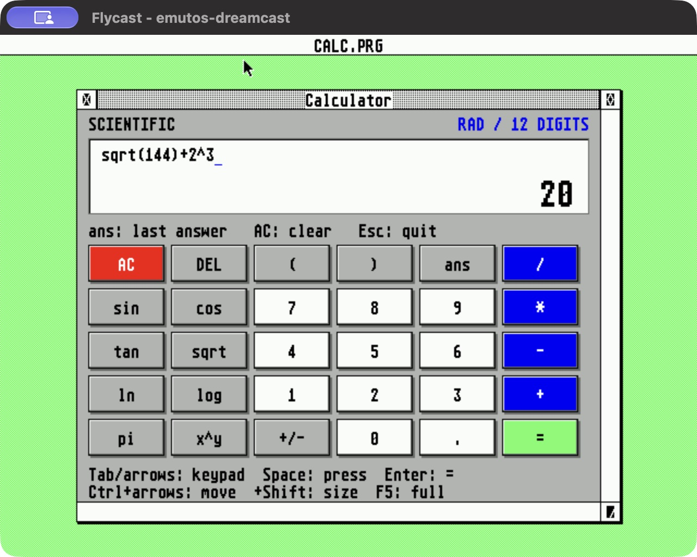

# Native application bundle

Every `.PRG` is separately compiled and relocated SH-4 machine code, using
native GEM AES/VDI calls and GEMDOS file access. There is no 68000 emulator,
SDL emulator, browser or host-side application doing the work.

The bundle combines a port of an existing Atari GEM application (GEM Worm)
with new GEM frontends for established portable open-source C projects.
Kilo, tinyexpr, stb_image and Simon Tatham's puzzles are **not presented as
original Atari applications**. Their real upstream engines are compiled
into the Dreamcast programs; they are not imitations of those programs.

| Program | Upstream and license | Native features |
|---|---|---|
| `EDITOR.PRG` | [Kilo](https://github.com/antirez/kilo), BSD-2-Clause | Plain-text editing, open/save/save-as, search, C syntax colours, CRLF input |
| `IMAGES.PRG` | [stb_image](https://github.com/nothings/stb), MIT/public domain | PNG/JPEG/BMP, 16-colour quantization, greyscale, mirror, BMP export |
| `CALC.PRG` | [tinyexpr](https://github.com/codeplea/tinyexpr), zlib | Movable/resizable GEM window, graphical keypad, editable expression and result display, scientific functions and `ans` |
| `WORM.PRG` | [GEM Worm](https://github.com/ArmstrongJ/gemworm), GPL-3.0-or-later | Original movement, field renderer, food and high-score code; new fullscreen GEM interface |
| `FIFTEEN.PRG` | [Simon Tatham's puzzles](https://www.chiark.greenend.org.uk/~sgtatham/puzzles/), MIT | Sliding tiles, undo/redo, new game, RAM-disk saves |
| `MINES.PRG` | Same collection, MIT | Minesweeper, keyboard cursor/flags, undo/redo, saves |
| `NET.PRG` | Same collection, MIT | Wire rotation, locking, keyboard/mouse controls, saves |
| `RUNTIME.PRG` | This project, GPL-2.0-or-later | Native libc, allocator, math and file-access diagnostic |

`HELLO.PRG` and `VDITEST.PRG` remain the ABI example and graphics diagnostic.
The separately maintained `SYSINFO.PRG` is included when built by the core
port. [APPS.TXT](../disc/APPS.TXT) is the on-disc keyboard reference.

The four games contain open-source code and draw their graphics themselves.
xrick was excluded following the user's choice to bundle four fully
open-source games: [its author's distribution page](https://www.bigorno.net/xrick/download.html)
does not provide an open-source grant for the original game's assets.

## Storage and controls

All programs start from D: in EmuDesk. Use **Alt+D** to open the disc;
Up/Down scroll the directory. Alt+arrows move the GEM pointer, Alt+Space
clicks, and Ctrl+O opens a selected program. The applications work with a
Dreamcast keyboard. The three puzzle frontends also accept Maple mouse
buttons and movement. Flycast verification primarily used the keyboard.

- Editor: Ctrl+O open, Ctrl+N new, Ctrl+S save, Ctrl+A save-as, Ctrl+F find,
  Ctrl+Q quit. Unsaved changes require repeated Ctrl+Q or confirmation
  before opening/creating another file. This is a plain-text editor, not
  a rich-text word processor; Kilo has no undo. Limit: 64 KiB / 1023 lines.
- Viewer: O open, N cycle the two samples, G greyscale, M mirror, S export
  BMP, Esc exit. Input is limited to 640×480 and 1 MiB encoded files.
  Display/export uses 16 colours; larger-than-384-pixel-tall images fit the
  viewing area. The export retains the decoded image dimensions.
- Calculator: click the graphical keypad or type an expression; Return or
  `=` evaluates, Ctrl+U / AC clears all, Esc exits. Tab selects the keypad,
  arrows move between buttons, and Space presses the focused button.
  Typing returns to the expression; Left/Right, Home/End, Backspace and
  Delete edit it. Click the expression to position the caret. DEL on the
  keypad is Backspace. Functions insert an opening parenthesis; close it
  with `)`. `+/-` negates the current expression or the evaluated result.
  `ans` holds the last successful evaluation; an operator after `=` continues
  from that answer, and a digit starts a new calculation. Errors preserve
  the previous answer and leave the expression editable. Angles are radians;
  exponentiation is left associative, as in the default tinyexpr configuration.
  The display shows 12 significant digits; calculations retain double precision.
  Drag the GEM title bar to move the window and its lower-right size gadget
  to resize it; the keypad adapts to the available space. The upper-right
  full-size gadget or F5 toggles full size and the previous size/position.
  Ctrl+arrows moves the window; Ctrl+Shift+arrows resizes it. The close box
  or Escape exits. The minimum work area is 432x328 pixels. This remains
  a single foreground TOS application; the file manager resumes on exit.
- Worm: P starts/pauses, arrows or WASD steer, N restarts, H shows scores,
  Esc exits. High scores go to `C:\WORM.HI`.
- Puzzles: arrows move, Space/Return select, F is the second action
  (Mines flag, Net lock). N new, U undo, R redo, S save, L load, H help,
  Esc exit. Files: `C:\FIFTEEN.SAV`, `C:\MINES.SAV`, `C:\NET.SAV`.

Use DOS 8.3 names when opening or saving. **C: is a RAM disk: reset and
power-off erase documents, exported images, scores and game saves.**
D: remains read-only. No persistent storage was added.

<a href="screenshots/calculator.jpg"></a>

## Source and build

`apps/vendor/sources.json` records upstream URLs, exact Git revisions and
imported files. Import and port changes are separate commits. Licenses
remain beside sources and are copied onto D: by `tools/stage_bundle.py`.
The new frontends are in `apps/ports/`; shared native support is in
`apps/lib/`. Worm's frontend is GPL-3.0-or-later, compatible with its engine;
the other new frontends/runtime are GPL-2.0-or-later, alongside the
permissive upstream notices. The SDK supplies newlib/libm and libgcc.

```sh
./scripts/build-apps.sh      # standalone native PRGs in build/apps/
./scripts/build-cdi.sh       # all programs, samples, licenses and bootable OS
python3 -m unittest discover -s tests -v
```

No network fetch, image-generation service or SDL installation is needed
for the application build. Source and sample assets are checked in.
The existing KallistiOS compiler and mkdcdisc setup is still required.
The complete bundle fits the existing 4 MiB D: volume.

## Port details

The runtime provides application-local newlib, GEMDOS-backed allocation,
file descriptors/stdio, process exit and command-line parsing. Portable C
sources use the compiler's normal alignment; GEM structs explicitly use
2-byte packing. Apps are single-threaded and their newlib lock hooks are
no-ops. Memory is owned by the native process and reclaimed on termination.
The native ABI's optional `millis` callback supplies monotonic game timing.

Kilo's terminal backend is replaced by GEM VDI text and AES keys. Its row
buffer, editing, search and syntax logic are retained. The Dreamcast save
path uses stdio in place of POSIX ftruncate; CRLF loading is corrected.
Worm's DOS/Atari resource menus are replaced by the keyboard-oriented GEM
frontend, avoiding an endian-dependent `.RSC`. Its field initialization,
restart growth and high-score loading/allocation bugs are corrected.
The puzzle engines are unmodified. Their frontend provides drawing,
events, animation timing, status, help and serialization; platform settings,
printing and configuration dialogs are not included.

The viewer uses native C decoding and quantization, then writes an
interleaved four-plane bitmap through VDI. The [sample artwork and prompts](../assets/samples/README.md)
include generated hedgehog fan art and an original space scene. These are
separate from the games and are not extracted commercial game assets.

The calculator uses AES window creation, move/size/top/close messages and
visible-rectangle redraws. Its VDI drawing is clipped to the intersection
of the damage rectangle, visible rectangles and window work area. It uses
the shared desktop palette and holds the screen lock only during redraws;
other bundled fullscreen apps keep their existing display ownership.

## Validation

Flycast, using the native CDI and keyboard input:

- Boot-time native allocation/stdio/math/read-only protection/cleanup test.
- Calculator: keyboard navigation of the graphical keypad (`7+8 = 15`),
  GEM pointer click on Multiply followed by typed `2` (`30`), syntax-error
  correction with Delete (`2+*3` to `2+3 = 5`), and `sqrt(144)+2^3 = 20`.
  Window move/resize and full-size/restore retain the result. Native GEM
  full-size and close gadgets work with the keyboard-controlled pointer.
  Closing the window restores EmuDesk with unchanged desktop colours.
- Editor: two-line input, save to C:, new buffer, reopen, search, exit.
- Viewer: both PNG samples; mirror/greyscale; BMP export to C: and reopen.
- Fifteen: tile movement, save, new game, restore saved board.
- Mines: reveal, flag, contrasting keyboard cursor and help/status redraw.
- Net: rotation and tile locking.
- Worm: drawing, movement, wall collision, restart, pause and score table.
- Programs return to EmuDesk; palette state is restored.

Host ASan/UBSan tests cover Kilo editing/CRLF/save round trips, image
quantization and exact exported BMP pixel recovery, puzzle state save/load,
Worm movement/restart/scores, and calculator keypad/keyboard input, cancelled
clicks, expression editing, result chaining, bounded input and error recovery.
Window binding tests cover move/resize constraints, full-size restoration,
partial/obscured redraw clipping, input and close/failure cleanup. They also
check that existing fullscreen apps still release their mouse/screen locks
and restore their palette.
The host checks complement real SH-4 execution; they are not a substitute
for it. Physical Dreamcast testing remains pending.
