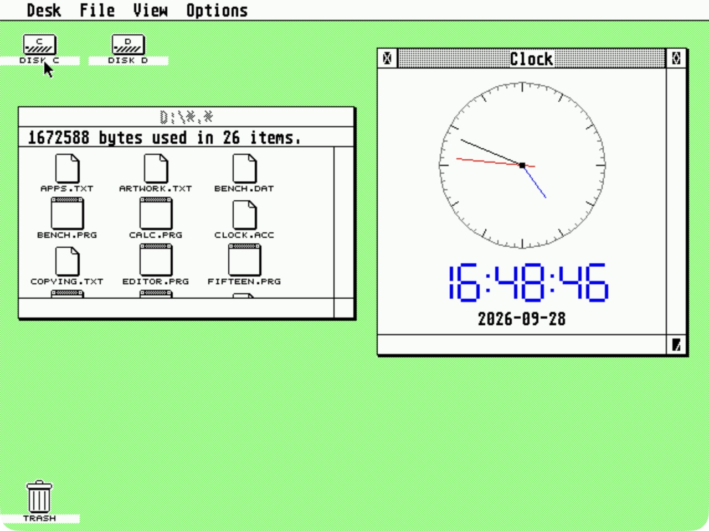

# Native application bundle

Every `.PRG` and `.ACC` is separately compiled and relocated SH-4 machine code, using
native GEM AES/VDI calls and GEMDOS file access. There is no 68000 emulator,
SDL emulator, browser or host-side application doing the work.

The bundle combines a port of an existing Atari GEM application (GEM Worm)
with native programs and new GEM frontends for established portable open-source C projects.
tinyexpr, stb_image and Simon Tatham's puzzles are **not presented as
original Atari applications**. Their real upstream engines are compiled
into the Dreamcast programs; they are not imitations of those programs.

| Program | Upstream and license | Native features |
|---|---|---|
| `EDITOR.PRG` (DreamEdit) | Native frontend and checked editor model, GPL-2.0-or-later; originally based on [Kilo](https://github.com/antirez/kilo), whose source is retained under BSD-2-Clause | GEM windows/menus, undo/redo, selection/clipboard, search/replace, wrapping, C colours, byte-preserving saves |
| `IMAGES.PRG` | [stb_image](https://github.com/nothings/stb), MIT/public domain | PNG/JPEG/BMP, 16-colour quantization, greyscale, mirror, BMP export |
| `PAINT.PRG` | This project, GPL-2.0-or-later | 16-colour paint: pencil, brush, shapes, fill, picker, multi-level undo, BMP open/save |
| `CALC.ACC` | [tinyexpr](https://github.com/codeplea/tinyexpr), zlib | Resident **Desk → Calculator** window, graphical keypad, scientific functions and `ans`; expression and answer survive closing and foreground program switches |
| `WORM.PRG` | [GEM Worm](https://github.com/ArmstrongJ/gemworm), GPL-3.0-or-later | Original movement, field renderer, food and high-score code; new fullscreen GEM interface |
| `BLOCKS.PRG` | This project, GPL-2.0-or-later | Original falling-block game: 10x20 well, SRS-style turns and kicks, 7-bag, hold, ghost piece, levels, top-5 scores |
| `FIFTEEN.PRG` | [Simon Tatham's puzzles](https://www.chiark.greenend.org.uk/~sgtatham/puzzles/), MIT | Sliding tiles, undo/redo, new game, RAM-disk saves |
| `MINES.PRG` | Same collection, MIT | Minesweeper, keyboard cursor/flags, undo/redo, saves |
| `NET.PRG` | Same collection, MIT | Wire rotation, locking, keyboard/mouse controls, saves |
| `BENCH.PRG` | This project, GPL-2.0-or-later | [CPU, memory, VDI and file benchmarks](BENCHMARK.md), three samples, text reports |
| `MP3.PRG` | [minimp3](https://github.com/lieff/minimp3), CC0-1.0 | [MP3/WAV player](AUDIO.md): SD/C:/D: file browser, playlist, ID3 tags, seek, volume, spectrum display; audio via the optional `audio_*` native API |
| `CLOCK.ACC` | This project, GPL-2.0-or-later | Resident GEM desk accessory; analogue face, digital time/date, movable/resizable window over the desktop |
| `CONTROL.ACC` | This project, GPL-2.0-or-later | Session input/display settings and live keyboard, mouse and controller diagnostics |
| `MONITOR.ACC` | This project, GPL-2.0-or-later | Memory history, free disk space, uptime and Maple device list |
| `VMUEDIT.PRG` | This project, GPL-2.0-or-later | Unified VMU Toolbox: card browser and metadata, hex/ASCII save viewer/editor with overwrite confirmation, file manager (import/export/rename/delete) with SD backup/restore shortcuts and verified exports, 48x32 LCD editor with live push and BMP/raw files, VMS save-icon editor; [details](ACCESSORIES.md#vmu-toolbox-vmueditprg) |
| `FTP.PRG` | This project, GPL-2.0-or-later | [Anonymous FTP server](FTP.md): GEM drive/folder picker, SD support, passive uploads/downloads and file management |
| `SDFORMAT.PRG` | This project, GPL-2.0-or-later | [SD card formatter](SD.md): graphical FAT16 quick format, C:/D: protection, metadata verification and remount or reboot prompt; in `D:\UTILS` |
| `RUNTIME.PRG` | This project, GPL-2.0-or-later | Native libc, allocator, math and file-access diagnostic |

`HELLO.PRG` and `VDITEST.PRG` remain the ABI example and graphics diagnostic.
The bundle also includes `SYSINFO.PRG`, maintained alongside the core port. [APPS.TXT](../disc/APPS.TXT) is the on-disc keyboard reference.

The four games contain open-source code and draw their graphics themselves.
xrick was excluded following the user's choice to bundle four fully
open-source games: [its author's distribution page](https://www.bigorno.net/xrick/download.html)
does not provide an open-source grant for the original game's assets.

## Storage and controls

The read-only disc groups programs into DOS 8.3 folders:

| Folder | Programs |
| --- | --- |
| `D:\APPS` | `EDITOR`, `IMAGES`, `PAINT`, `MP3` |
| `D:\GAMES` | `FIFTEEN`, `MINES`, `NET`, `WORM`, `BLOCKS` |
| `D:\UTILS` | `FTP`, `VMUEDIT`, `SDFORMAT`, `SYSINFO`, `BENCH`, `HELLO`, `VDITEST`, `RUNTIME`, all `.TTP` tools |

`BENCH.DAT` lives beside the benchmark in `UTILS`. Guides, sample pictures,
license notices and the four startup `.ACC` files stay at the root. AES scans
the root for accessories at boot. All three program folders are on the default
EmuCON search path, so commands such as `editor`, `mines` and `ftp` work by name.

Open APPS, GAMES or UTILS on D: in EmuDesk to find a program. All four desk accessories load
automatically at boot; open them from **Desk**. See the
[Dreamcast accessories guide](ACCESSORIES.md) for the control panel, monitor
and the unified VMU Toolbox program. Use **Alt+D** to open the disc;
Up/Down scroll the directory. Alt+arrows move the GEM pointer, Alt+Space
clicks, and Ctrl+O opens a selected program. The applications work with a
Dreamcast keyboard. The three puzzle frontends also accept Maple mouse
buttons and movement. Flycast verification primarily used the keyboard.

- Clock: **Desk → Clock** opens or raises its window while the desktop remains
  usable. The close box or Esc hides it; choose the menu again to reopen.
  Drag the title/size gadgets, or use Ctrl+arrows to move and Ctrl+Shift+arrows
  to resize. It displays the console clock initialized from the Dreamcast RTC
  (the emulated RTC in Flycast), in 24-hour format with GEMDOS two-second
  precision. Starting or exiting a foreground program hides its window; the
  accessory remains resident and can be reopened from the desktop.
- DreamEdit: a resizable GEM window with File/Edit/Search/View menus, mouse selection,
  scrollbars and native file selectors. Ctrl+N/O/S create/open/save; Ctrl+Shift+S
  saves as; Ctrl+Q closes. Unsaved work gets Save/Discard/Cancel on new/open/close.
  Ctrl+Z/Y undo/redo (Ctrl+Shift+Z also redoes); Ctrl+X/C/V cut/copy/paste;
  Ctrl+A selects all. Shift extends arrow/Home/End/Page selections, Ctrl+arrows
  move by word, Ctrl+Home/End jump to the document ends. Drag outside the text
  area to scroll while selecting. The GEM clipboard uses `SCRAP.TXT` in the AES
  scrap directory, with an internal fallback if it cannot be written.
  Ctrl+F finds, F3/Shift+F3 find the next/previous occurrence (including matches
  on the same line); Ctrl+H replaces one, Ctrl+Shift+H replaces all as one undo
  action; Ctrl+G goes to a line. Search is literal, wraps, and has a Match case
  menu option. Ctrl+W toggles word wrap; Ctrl+L toggles line numbers. View also
  controls auto-indent, tab width (1–8), and inserting spaces. Tab/Shift+Tab
  indent/outdent selected lines. Line/column and modified state are always visible.
  New files default to the first writable SD drive, falling back to C: RAM.
  Saves preserve LF/CRLF (including mixed input) and the final-newline state;
  Enter/paste use the first line ending's convention. Saving writes and verifies
  a same-directory `EDnnnnnn.TMP`, moves the old file to `EDnnnnnn.BAK`, then
  installs the new file. Failed replacement restores the original when possible
  and reports retained recovery paths. This is recovery protection, not a
  power-loss-atomic filesystem transaction. Use DOS 8.3 filenames.
  Limit: 1 MiB / 32,768 logical lines, subject to available memory; 128 undo
  actions with about 2 MiB of changed text. Consecutive typing is grouped until
  a pause or another command. Undo/clipboard are session state. The editor uses
  the system's single-byte font encoding, not Unicode or rich text.
- Viewer: O open, N cycle the two samples, G greyscale, M mirror, S export
  BMP, Esc exit. Input is limited to 640×480 and 1 MiB encoded files.
  Display/export uses 16 colours; larger-than-384-pixel-tall images fit the
  viewing area. The export retains the decoded image dimensions.
- Paint: mouse (left/right button = foreground/background colour) or keyboard. Tools P pen, B brush, X eraser, L line, R rectangle, F filled rectangle, E ellipse, K filled ellipse, G fill, I picker, H pan; colours 0-9 and !@#$%^, `[` `]` cycle, Tab swaps; `+`/`-` size; U/Ctrl+Z undo, Y/Ctrl+Y redo, C clear; arrows move a cross and Space/Return draw with the foreground/background colour (Alt+arrows and Alt+Space also work); Ctrl+N/O/S/A new/open/save/save-as (BMP, defaulting to the SD drive), `?` help. The 640x480 canvas scrolls in the view (Pan tool, Home/End/PgUp/PgDn, or drag past the edge); undo keeps up to 64 changed rectangles within 1 MiB. Opens the IMAGES viewer's BMP exports.
- Calculator: choose **Desk → Calculator**. Click the graphical keypad or type
  an expression; Return or `=` evaluates, Ctrl+U / AC clears all. Esc hides the
  accessory, retaining its calculation. Tab selects the keypad,
  arrows move between buttons, and Space presses the focused button.
  Typing returns to the expression; Left/Right, Home/End, Backspace and
  Delete edit it. Click the expression to position the caret. DEL on the
  keypad is Backspace. Functions insert an opening parenthesis; close it
  with `)`. `+/-` negates the current expression or the evaluated result.
  `ans` holds the last successful evaluation; an operator after `=` continues
  from that answer, and a digit starts a new calculation. Errors preserve
  the previous answer and leave the expression editable. Angles are radians;
  exponentiation is left associative, as in the default tinyexpr configuration.
  The display shows 12 significant digits; calculations retain double precision.
  Drag the GEM title bar to move the window and its lower-right size gadget
  to resize it; the keypad adapts to the available space. The upper-right
  full-size gadget or F5 toggles full size and the previous size/position.
  Ctrl+arrows moves the window; Ctrl+Shift+arrows resizes it. The close box
  or Escape exits. The minimum work area is 432x328 pixels. This remains
  a single foreground TOS application; the file manager resumes on exit.
- Worm: P starts/pauses, arrows or WASD steer, N restarts, H shows scores,
  Esc exits. High scores go to `C:\WORM.HI`.
- Blocks: arrows move, Up/X turn right, Z turn left, Down soft drop, Space
  hard drop, C hold, P pause, Esc menu. Controller: D-pad move/soft drop, Up or Y
  hard drop, A/B turn, X hold, Start pause. High scores (top 5) go to the
  persistent drive (SD card if present, else `C:\BLOCKS.HI`).
- Puzzles: arrows move, Space/Return select, F is the second action
  (Mines flag, Net lock). N new, U undo, R redo, S save, L load, H help,
  Esc exit. Files: `C:\FIFTEEN.SAV`, `C:\MINES.SAV`, `C:\NET.SAV`.

Use DOS 8.3 names when opening or saving. **C: is a RAM disk: reset and
power-off erase documents, exported images, scores and game saves.**
D: remains read-only. No persistent storage was added.

<a href="screenshots/calculator.jpg"></a>

## Source and build

`apps/vendor/sources.json` records upstream URLs, exact Git revisions and
imported files. Import and port changes are separate commits. Licenses
remain beside sources and are copied onto D: by `tools/stage_bundle.py`.
The new frontends are in `apps/ports/`; shared native support is in
`apps/lib/`. Worm's frontend is GPL-3.0-or-later, compatible with its engine;
the other new frontends/runtime are GPL-2.0-or-later, alongside the
permissive upstream notices. The SDK supplies newlib/libm and libgcc.

```sh
./scripts/build-apps.sh      # standalone native PRGs in build/apps/
./scripts/build-cdi.sh       # all programs, samples, licenses and bootable OS
python3 -m unittest discover -s tests -v
```

No network fetch, image-generation service or SDL installation is needed
for the application build. Source and sample assets are checked in.
The existing KallistiOS compiler and mkdcdisc setup is still required.
The complete bundle fits the existing 4 MiB D: volume.

## Port details

The runtime provides application-local newlib, GEMDOS-backed allocation,
file descriptors/stdio, process exit and command-line parsing. Portable C
sources use the compiler's normal alignment; GEM structs explicitly use
2-byte packing. Apps are single-threaded and their newlib lock hooks are
no-ops. Memory is owned by the native process and reclaimed on termination.
The native ABI's optional `millis` callback supplies monotonic game timing.

DreamEdit began as a Kilo port and now uses a checked, byte-preserving document
model in `editor_core.c`, separate staged file I/O, and a GEM frontend. The original
vendored Kilo source is retained unmodified, with its BSD-2-Clause license.
The executable remains `EDITOR.PRG`, so existing shortcuts and scripts keep working.
Undo records store changed spans, allocation failures
leave edits unapplied, and file loads stage the new document before replacing
the old one. C/C++ highlighting tracks multiline comments and colours keywords,
types, strings, numbers and preprocessor directives. Visible rows are compared
before drawing; VDI text is batched by colour/selection and damage is clipped
through the shared GEM window API. Word-wrap positions use document byte offsets,
so resizing and tab expansion do not change the selection or saved text.
Worm's DOS/Atari resource menus are replaced by the keyboard-oriented GEM
frontend, avoiding an endian-dependent `.RSC`. Its field initialization,
restart growth and high-score loading/allocation bugs are corrected.
The puzzle engines are unmodified. Their frontend provides drawing,
events, animation timing, status, help and serialization; platform settings,
printing and configuration dialogs are not included.

The viewer uses native C decoding and quantization, then writes an
interleaved four-plane bitmap through VDI. The [sample artwork and prompts](../assets/samples/README.md)
include generated hedgehog fan art and an original space scene. These are
separate from the games and are not extracted commercial game assets.

The calculator uses AES window creation, move/size/top/close messages and
visible-rectangle redraws. Its VDI drawing is clipped to the intersection
of the damage rectangle, visible rectangles and window work area. It uses
the shared desktop palette and holds the screen lock only during redraws;
other bundled fullscreen apps keep their existing display ownership.

## Validation

Flycast, using the native CDI and keyboard input:

- Boot-time native allocation/stdio/math/read-only protection/cleanup test.
- Calculator: keyboard navigation of the graphical keypad (`7+8 = 15`),
  GEM pointer click on Multiply followed by typed `2` (`30`), syntax-error
  correction with Delete (`2+*3` to `2+3 = 5`), and `sqrt(144)+2^3 = 20`.
  Window move/resize and full-size/restore retain the result. Native GEM
  full-size and close gadgets work with the keyboard-controlled pointer.
  Closing the window restores EmuDesk with unchanged desktop colours.
- DreamEdit: selection/copy/paste, undo/redo, search/replace, wrap/resize/scroll,
  save to C:/SD, reopen, and cancel/save/discard on close.
- Viewer: both PNG samples; mirror/greyscale; BMP export to C: and reopen.
- Fifteen: tile movement, save, new game, restore saved board.
- Mines: reveal, flag, contrasting keyboard cursor and help/status redraw.
- Net: rotation and tile locking.
- Worm: drawing, movement, wall collision, restart, pause and score table.
- Programs return to EmuDesk; palette state is restored.

Host ASan/UBSan tests cover editor selection, undo/redo, CRLF/final-newline
preservation, search/replace, wrap, allocation failures, size limits, randomized
edits and staged-save recovery, image
quantization and exact exported BMP pixel recovery, puzzle state save/load,
Worm movement/restart/scores, and calculator keypad/keyboard input, cancelled
clicks, expression editing, result chaining, bounded input and error recovery.
Window binding tests cover move/resize constraints, full-size restoration,
partial/obscured redraw clipping, input and close/failure cleanup. They also
check that existing fullscreen apps still release their mouse/screen locks
and restore their palette.
The host checks complement real SH-4 execution; they are not a substitute
for it. Physical Dreamcast testing remains pending.

## Clock desk accessory



## Command-line tools

The CDI also includes native `GREP`, `WC`, `HEAD`, `TAIL`, `SORT`, `HEXDUMP`,
`CKSUM`, `DATE`, `DF`, `FREE`, `UNAME` and `EXPR` `.TTP` programs. Open EmuCON
with Ctrl+Z and use their names without extensions. See [the command-line
guide](COMMAND-LINE.md), or `D:\CLI.TXT`. These tools are GPL-2.0-or-later;
EXPR uses the existing TinyExpr dependency and its bundled notice.

## SSH terminal

`UTILS/SSH.TTP` supports SSH-2 password, keyboard-interactive and OpenSSH-key
login over the shared KOS stack. See [SSH setup](SSH.md), including recommended
private seed preparation and the option to accept weak randomness instead.
It is GPL-3.0-or-later; wolfSSH, wolfCrypt,
libvterm and OpenBSD bcrypt notices are included in the disc root.
